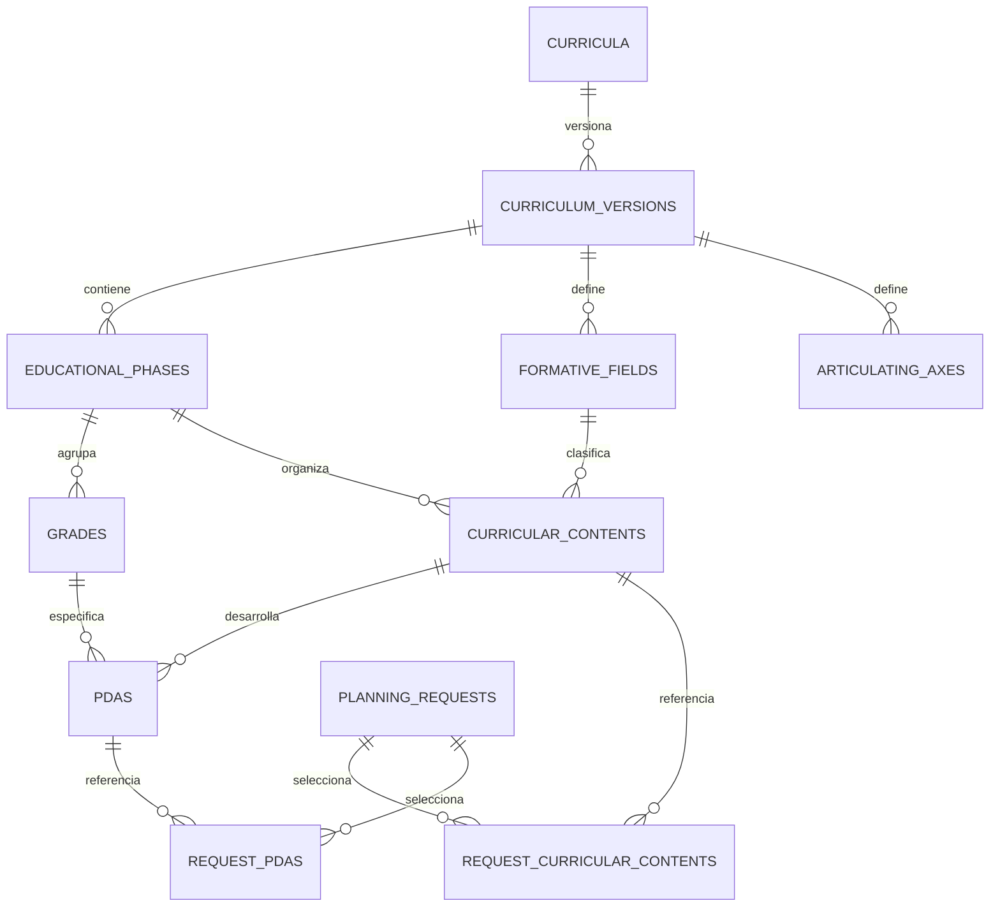

# Catálogo curricular y selección asistida

## Soporte multinivel — Preescolar y Primaria

La plataforma admite currículos independientes por nivel educativo. El nivel se registra en `curricula.educational_level` y no se duplica en grupos ni solicitudes: cada `Group` referencia una `CurriculumVersion` seleccionable y un `Grade` de esa misma versión.

Niveles productivos iniciales:

- `preschool` — Preescolar (kínder), Fase 2, grados internos `P1`, `P2`, `P3`.
- `primary` — Primaria, Fases 3, 4 y 5, grados internos `G1` a `G6`.

Preescolar y Primaria se mantienen como `Curriculum` distintos. No se agregan grados de preescolar al árbol de primaria. Los cuatro Campos formativos y los siete Ejes articuladores pueden compartir códigos internos entre currículos porque su identidad de base de datos está acotada por `CurriculumVersion`.

Al confirmar una planeación se congela `educational_level` y un `pedagogical_stage` derivado del nivel y grado. Este perfil sirve como calibración para generación, auditoría y corrección: incluye una banda interna de complejidad, guardrails, prácticas a evitar y énfasis de evaluación. La banda NO es una escala oficial SEP, no diagnostica capacidades y nunca sustituye los PDA, el contexto ni el perfil real del grupo.

La progresión interna inicial usa bandas consecutivas `preschool_1..3 = 1..3` y `primary_1..6 = 4..9`. Su objetivo es impedir dos errores de producto: escolarizar prematuramente preescolar y generar tareas de secundaria/adultos para los grados altos de primaria. Dentro de cada grado, la dificultad real se determina por los PDA seleccionados y el contexto del grupo.


Iteración funcional previa a Fase 1. Solo diseño; no datos curriculares reales, migraciones ni seeders ejecutables. Este documento define el módulo curricular del monolito existente.

## Entidades y relaciones — MVP

Todos los elementos curriculares pertenecen a una CurriculumVersion. Los códigos son únicos dentro de su versión, no identificadores oficiales inventados ni constantes de PHP. Nombres y textos se almacenan completos; no se asume una cantidad fija de fases, grados, campos o ejes.

| Entidad / tabla | Campos y relaciones |
|---|---|
| Curriculum / curricula | id, code UNIQUE, name, country_code, educational_level, description, selectable_version_id nullable |
| CurriculumVersion / curriculum_versions | curriculum_id FK, number, label, source_reference nullable, effective_from/until nullable, published_at, published_by, checksum; UNIQUE(curriculum_id,number) |
| EducationalPhase / educational_phases | curriculum_version_id, code, name, description, sort_order |
| Grade / grades | curriculum_version_id, educational_phase_id, code, name, ordinal, sort_order; fase 1:N grados |
| FormativeField / formative_fields | curriculum_version_id, code, name, description, sort_order |
| CurricularContent / curricular_contents | curriculum_version_id, educational_phase_id, formative_field_id, code, title, full_text, source_locator nullable, sort_order |
| Pda / pdas | curriculum_version_id, curricular_content_id, grade_id, code, full_text, source_locator nullable, sort_order; contenido 1:N PDA; grado 1:N PDA |
| ArticulatingAxis / articulating_axes | curriculum_version_id, code, name, description, sort_order |

UNIQUE(curriculum_version_id,code) en las seis tablas de elementos. UNIQUE(id,curriculum_version_id) habilita FK compuestas que impiden mezclar versiones. Grade enlaza fase de su versión; Content enlaza fase/campo de su versión; Pda enlaza contenido y grado de su versión, cuya fase debe coincidir. Esa última regla se valida transaccionalmente al editar/publicar; no usar CHECK con consultas a otras tablas. Un contenido de fase puede tener PDA distintos por grado; no duplicar el contenido por cada PDA. Para publicar, todo contenido ofrecido para un grado debe tener al menos un PDA aplicable a ese grado. Si una fuente futura requiere otra cardinalidad, se amplía explícitamente; no crear un motor de ontologías en el MVP.

Ejes son transversales: no imponer un eje obligatorio por contenido ni inventar correspondencias oficiales. Solicitud selecciona N campos/contenidos/PDA y N ejes; campos derivados de contenidos, ejes elegidos/confirmados por docente. Se permite trabajo entre campos dentro de una misma versión y grado. Multigrado y mezcla de versiones en una solicitud: POST-MVP.



## Publicación y permisos — MVP

Borrador equivale a published_at null. Administrador edita borrador y publica en una transacción, validando referencias, integridad, textos, grado/fase, procedencia y checksum del árbol. Publicación congela la fila CurriculumVersion, todos sus elementos y relaciones: prohibir INSERT/UPDATE/DELETE del árbol publicado, incluso agregar un PDA. Corrección editorial requiere clonar una nueva versión borrador, nunca actualizar la publicada.

Acciones y Policies más triggers PostgreSQL que bloquean mutación del árbol publicado; las escrituras y publicación bloquean la misma fila raíz para evitar carrera publicación/edición. El rol de ejecución no puede desactivar triggers ni hacer DDL/TRUNCATE. Versiones referenciadas usan FK RESTRICT; no borrar historial. No implementar event sourcing.

La disponibilidad comercial se cambia mediante curricula.selectable_version_id, fuera del árbol inmutable: debe apuntar a versión publicada del mismo currículo. Una versión reemplazada sigue consultable históricamente, pero no se selecciona para nuevas solicitudes. Un borrador viejo requiere reselección y confirmación antes de envío; no sustituirlo silenciosamente. Solicitudes enviadas mantienen su versión y snapshot.

Lectura del catálogo disponible para docentes autenticados/verificados; edición/publicación exclusivamente administrativa. Revisor recibe snapshot de trabajo asignado, no facultad para editar catálogo. Aplicar las reglas existentes de PERMISSIONS.md a selecciones/propuestas propias; no modificar ese documento en esta iteración.

## Grupos, selecciones y snapshot — MVP

groups guarda curriculum_version_id y grade_id; grado determina fase. Al elegir nueva versión se remapea grado explícitamente, no por igualdad numérica automática. Perfil incluye preferred_format_id como preferencia reutilizable; al enviar se resuelve format_version_id publicada y compatible del cliente o estándar. Cambiar grupo, grado, fechas, tema, materiales o versión invalida propuesta/confirmación; eventos y observaciones también forman parte del fingerprint.

planning_requests guarda curriculum_version_id, grade_id, creation_mode (quick/advanced), curriculum_confirmed_at y selection_revision. Relaciones:

- request_curricular_contents(request_id, curriculum_version_id, curricular_content_id), PK(request_id,curricular_content_id).
- request_pdas(request_id, curriculum_version_id, pda_id), PK(request_id,pda_id).
- request_articulating_axes(request_id, curriculum_version_id, articulating_axis_id), PK(request_id,articulating_axis_id).

FK compuestas a solicitud y catálogo garantizan misma versión. Enviar exige PDA del grado elegido y de contenidos seleccionados; cada contenido seleccionado tiene al menos un PDA seleccionado. Campos se derivan, sin una cuarta lista editable inconsistente. Se permiten notas pedagógicas locales separadas; modificar sugerencia significa cambiar selección o anotación, no reescribir un PDA del catálogo. Se validan y congelan selecciones al enviar; revisiones posteriores de entrada conservan versiones anteriores.

Snapshot textual completo en request_input_versions: nombre/código/versión/procedencia del currículo, fase/grado, códigos y textos completos de campos, contenidos, PDA y ejes seleccionados, vínculos contenido-PDA, evaluación inicial confirmada, anotaciones docentes, perfil completo y formato/version, fechas, materiales/manifest y cálculo comercial. No basta guardar IDs ni un resumen IA. Incluye checksum curricular, selection_revision, confirmed_by y confirmed_at. Solo se copian elementos seleccionados y sus ancestros, no todo el catálogo. Pipeline genera y audita desde este snapshot, nunca desde el catálogo activo del momento.

## Propuesta automática — MVP acotado

CurriculumSuggestionService.suggest(SuggestionInput): SuggestionResult es independiente de UI y proveedor. Input: grupo/grade_id, versión publicada, revisión de perfil, fechas, tema/proyecto, páginas/material limpio y observaciones. Output: IDs válidos de contenidos/PDA/ejes, campos derivados, evaluación inicial sugerida, explicación breve y faltantes. No crea contenido curricular oficial. Página sin libro/material identificado no permite afirmar que se leyó el texto; pedir referencia o proponer solo con tema y explicitarlo.

Adapter inicial de búsqueda/reglas sobre catálogo, determinista y testeable; adapter IA opcional POST-MVP para esta recomendación, sin afectar el adapter IA de generación ya previsto en MVP. Servicio recupera candidatos del grado/versión y no propone elementos de otros grados. Sin coincidencias, no seleccionar arbitrariamente: ofrecer búsqueda avanzada y conservar borrador. La confirmación docente siempre es explícita; una propuesta no es una solicitud enviada y no consume planning_limit.

curriculum_suggestions: request_id, input_fingerprint, curriculum_version_id, strategy_version, status (pending/ready/failed/stale), result JSONB con IDs/evaluación/motivos, created_at, confirmed_at nullable; UNIQUE(request_id,input_fingerprint,strategy_version). ownership vía solicitud. Solo una propuesta vigente por fingerprint; resultado de una petición antigua no pisa datos nuevos. Validar IDs otra vez al confirmar y enviar. Límites de frecuencia y caché por fingerprint evitan regeneraciones innecesarias; costos de propuesta, si hubiera adapter IA, se registran aunque el borrador nunca se envíe.

## Seeders de ejemplo — diseño, no ejecución

CurriculumExampleSeeder, solo local/test: currículo DEMO, etiqueta visible «Datos ficticios, sin validez curricular», una versión publicada DEMO-1, otra borrador DEMO-2; dos fases ficticias, varios grados, dos campos, contenidos con PDA diferenciados por grado y dos ejes. Textos «Contenido de ejemplo A» y «PDA de ejemplo A1», sin copiar ni simular textos oficiales. Segunda versión cambia un texto para verificar que una solicitud histórica conserva DEMO-1. Fixtures negativas se crean solo en tests, no en catálogo publicado: mezcla de versión/fase, PDA incompatible y falta de texto.

PublicationExampleSeeder propone una publicación válida por las mismas acciones; no bypass de inmutabilidad. SuggestionExampleFixtures cubren coincidencia, varias candidatas y ausencia de coincidencia. No crear estos archivos ahora. Producción no ejecuta seeders demo; antes de vender será necesario cargar y validar un catálogo real por proceso editorial separado, fuera de esta entrega.

## Importación administrativa estructurada — MVP, Fase 2

Permitir cargar cientos de contenidos/PDA previamente estructurados mediante JSON o CSV, sin captura individual. No es extracción inteligente ni sincronización externa. El archivo no constituye una fuente oficial por sí mismo: la validación curricular y de procedencia antes de publicar sigue siendo responsabilidad administrativa/editorial. Validación técnica satisfactoria no equivale a aprobación pedagógica.

Acción conceptual ImportCurriculumDraft, apoyada por CurriculumImportService.import(source, actor, dryRun): ImportReport. El comando administrativo `php artisan curriculum:import <archivo> --actor=<administrador> [--dry-run]` llama la misma acción, sin duplicar reglas. Solo ejecución desde entorno administrativo autorizado y actor administrador activo; el parámetro actor identifica al responsable, no concede permisos por sí mismo. No existe opción publish, force, overwrite ni actualización de versiones existentes en este MVP.

### Contrato de archivo

Aceptar únicamente schema_version=1 del contrato curricular de importación; es independiente del número de CurriculumVersion. Versiones de schema desconocidas, campos desconocidos y formatos distintos se rechazan. Implementación futura debe incluir schema y ejemplos ficticios versionados; no se crean archivos de código ahora.

- JSON UTF-8: objeto raíz con schema_version, curriculum_code, curriculum_version y arrays educational_phases, grades, formative_fields, curricular_contents, pdas, articulating_axes. curriculum_code debe identificar un Curriculum existente; no cambiar sus metadatos al importar. curriculum_version contiene number, label, source_reference opcional y effective_from/until opcionales. Los elementos contienen code y los campos de su entidad definidos arriba; referencias por phase_code, field_code, content_code y grade_code, nunca IDs de base de datos. Cada array es obligatorio y no vacío en este contrato inicial.
- CSV UTF-8: un archivo con encabezado fijo y record_type (version/phase/grade/field/content/pda/axis). Columnas: schema_version, curriculum_code, record_type, version_number, label, source_reference, effective_from, effective_until, code, name, description, sort_order, ordinal, phase_code, field_code, title, full_text, source_locator, content_code, grade_code. Una fila version y al menos una por cada otro tipo; schema_version y curriculum_code repetidos e idénticos en todas las filas. Columnas no aplicables deben estar vacías. Separador coma, comillas dobles para textos con coma/salto de línea y escape de comilla duplicada; no adivinar delimitadores ni ejecutar fórmulas. Ambos parsers producen el mismo DTO canónico y aplican el mismo schema semántico.

Campos requeridos: versión number/label; fase/campo/eje code/name; grado code/name/ordinal/phase_code; contenido code/title/full_text/phase_code/field_code; PDA code/full_text/content_code/grade_code. Descripciones, localizadores y sort_order opcionales; orden ausente deriva del orden del archivo. Textos requeridos no vacíos, enteros y fechas válidos, fechas final >= inicial cuando ambas existan. Definir límites explícitos de bytes, filas y longitud de campo antes de implementar; rechazar exceso sin importar parcialmente. Códigos sin espacios exteriores, sensibles a mayúsculas y sin conversión silenciosa; duplicado significa mismo code dentro del mismo tipo y versión. Referencias deben coincidir exactamente.

### Validación y transacción

1. Autorizar actor, comprobar tipo/tamaño, leer y validar schema. Detectar códigos duplicados, campos inválidos y registros desconocidos con ubicación de origen. No consultar URLs indicadas en source_reference.
2. Abrir transacción PostgreSQL y bloquear Curriculum padre. Validar existencia del currículo y que (curriculum_id, number) no exista. Si existe publicada, error VERSION_PUBLISHED; si existe borrador, VERSION_EXISTS. Reimportación nunca mezcla, reemplaza ni duplica: corregir archivo fallido o elegir explícitamente otro número para nueva versión.
3. Resolver todas las relaciones del archivo y validar fases, grados, campos, contenidos, PDA y ejes. Rechazar referencias inexistentes, mezclas de versión, PDA cuyo grado no comparte fase con su contenido y restantes invariantes curriculares. No completar referencias buscando elementos de otra versión. UNIQUE/FK y protecciones de publicación existentes siguen siendo autoridad ante concurrencia.
4. Si hay errores, abortar sin crear filas. Si es dry-run, devolver diagnóstico y cantidades previstas sin escrituras, auditoría persistida, archivos guardados ni eventos. Ejecutar las mismas comprobaciones de datos/estado del destino; no insertar para luego revertir. El dry-run no reserva número de versión: la importación real revalida todo.
5. En ejecución real válida, crear únicamente CurriculumVersion borrador (published_at/published_by/checksum de publicación nulos) y sus elementos en orden de dependencias dentro de esa misma transacción. Registrar acción de auditoría con actor, schema_version, hash del archivo y conteos; cualquier fallo revierte toda la importación. No cambiar selectable_version_id, no publicar y no disparar propuestas ni generación.

El MVP es create-only deliberadamente: incluso un borrador existente se edita por las acciones editoriales ya previstas o se importa como otra versión. Esto evita reemplazos parciales y no añade tablas ni mecanismos de merge. La publicación permanece como acción administrativa independiente tras revisión editorial; los triggers existentes impiden modificar cualquier versión publicada.

### Resumen, errores y pruebas previstas

ImportReport indica modo, éxito/fallo, currículo, número de versión, draft_id solo tras commit, hash del archivo, conteos por entidad y total, advertencias editoriales y errores con code/message/location (ruta JSON o fila/columna CSV, código del elemento y referencia). Nunca informar «importado» en dry-run: «válido, se crearían…». Error devuelve estado no exitoso del comando y resumen «0 registros creados»; no exponer trazas SQL ni volcar textos completos en logs. Un reporte con demasiados errores puede truncar su detalle avisándolo, pero nunca continuar con filas válidas solamente.

Fase 2 debe probar JSON/CSV equivalentes, schema desconocido, texto requerido ausente, duplicados, referencias inexistentes, fase/grado incompatible, versión publicada y borrador existente, falta de permisos, rollback ante fallo intermedio, importaciones concurrentes y dry-run sin cambios. Verificar que importación válida termina en borrador no seleccionable y que publicación solo ocurre mediante acción editorial separada. Fixtures únicamente ficticias, sin cargar datos reales en esta entrega.

### Contrato JSON definitivo — Subfase 2A.2 (schema_version = 1)

Este contrato es el implementado en `App\Services\Curriculum\CurriculumImportService` y verificado por `tests/Feature/CurriculumImportTest.php`. El CSV queda POST-MVP; primero se estabiliza JSON. Las diferencias respecto al borrador provisional `curriculum_import_contract_draft.json` se detallan al final de esta sección.

Objeto raíz obligatorio:

- `schema_version` — entero, único valor aceptado: `1`.
- `curriculum` — objeto con:
  - `code` (string, 1..64, sin espacios exteriores). Identifica el `Curriculum`. Si existe, se reutiliza tal cual y su metadata no se modifica; si no existe, se crea con los campos del objeto.
  - `name` (string, 1..1024).
  - `country_code` (string, ≤8, opcional).
  - `educational_level` (string, ≤64, opcional).
  - `description` (string, ≤20000, opcional).
- `version` — objeto con:
  - `number` (entero ≥ 1). La pareja `(curriculum_id, number)` debe no existir.
  - `label` (string, 1..255).
  - `source_reference` (string o objeto JSON, opcional). Si es objeto se serializa a JSON antes de persistir en la columna `source_reference`.
  - `effective_from`, `effective_until` (string `YYYY-MM-DD` o `null`, opcionales; final ≥ inicial).
- `educational_phases` — arreglo NO vacío de `{code, name, description?, sort_order?}`.
- `grades` — arreglo NO vacío de `{code, name, phase_code, ordinal, sort_order?}`.
- `formative_fields` — arreglo NO vacío de `{code, name, description?, sort_order?}`.
- `curricular_contents` — arreglo NO vacío de `{code, title, full_text, phase_code, field_code, source_locator?, sort_order?}`.
- `pdas` — arreglo NO vacío de `{code, full_text, content_code, grade_code, source_locator?, sort_order?}`.
- `articulating_axes` — arreglo NO vacío de `{code, name, description?, sort_order?}`.

Reglas de códigos y referencias:

- Todos los `code` son códigos internos de la plataforma; nunca IDs de base de datos ni identificadores oficiales. Son sensibles a mayúsculas y no pueden llevar espacios al inicio o al final.
- Los `code` deben ser únicos dentro de su propia colección. Duplicados dentro del archivo se rechazan con `DUPLICATE_CODE`.
- Referencias válidas: `grades[].phase_code`, `curricular_contents[].phase_code|field_code`, `pdas[].content_code|grade_code`. Referencias no encontradas producen `REFERENCE_NOT_FOUND`.
- Invariante fase/grado: para cada PDA, la `phase_code` del `Grade` referenciado debe coincidir con la `phase_code` del `CurricularContent` referenciado. Incumplimientos: `PDA_GRADE_PHASE_MISMATCH`.
- Advertencia (no error): si algún contenido queda sin PDA en el archivo, el reporte emite un `warning` porque la publicación posterior fallará hasta agregarlo. La importación de borrador SÍ se permite en ese caso.

Códigos de error semánticos emitidos por el servicio:

- `SCHEMA_VERSION_UNSUPPORTED`, `MISSING_FIELD`, `INVALID_FIELD`.
- `DUPLICATE_CODE`, `REFERENCE_NOT_FOUND`, `PDA_GRADE_PHASE_MISMATCH`.
- `VERSION_EXISTS` (borrador con mismo número), `VERSION_PUBLISHED` (versión publicada con mismo número).
- `ACTOR_NOT_AUTHORIZED` (actor no administrador activo).
- `INVALID_JSON` (archivo no parseable) — emitido por `ImportCurriculumDraft`.
- `IMPORT_TRANSACTION_FAILED` (fallo en escritura una vez validado; provoca rollback total).

Comportamiento operativo:

- Comando: `php artisan curriculum:import <archivo.json> --actor=<email|id> [--dry-run]`. `--actor` es obligatorio y debe resolver a un `User` con rol Administrator y `status=active`.
- Atomicidad: toda la ingesta ocurre dentro de una única transacción PostgreSQL. Cualquier error revierte todo; no quedan registros parciales. El dry-run realiza las mismas validaciones y aborta la transacción sin escribir.
- Idempotencia (create-only): la reimportación del mismo archivo falla con `VERSION_EXISTS` o `VERSION_PUBLISHED`. No hay merge, upsert ni sobrescritura. Para corregir, se ajusta el archivo y se importa con otro `version.number`, o se elimina el borrador previo por acción editorial separada.
- La importación NUNCA publica: `published_at`, `published_by` y `checksum` quedan `NULL`. `curricula.selectable_version_id` NUNCA se modifica desde el importador.
- Los triggers de inmutabilidad y las FK compuestas de PostgreSQL siguen activos; el servicio no los deshabilita y usa modelos Eloquent normales, respetando policies y guardas.
- Auditoría: cada ejecución exitosa registra en el log `curriculum.import` con `actor_id`, `curriculum_code`, `version_number`, `draft_id`, `file_hash` (SHA-256 del archivo), conteos y `dry_run`.

Ejemplo mínimo:

```json
{
  "schema_version": 1,
  "curriculum": {"code": "DEMO-IMP", "name": "Currículo ficticio"},
  "version": {"number": 1, "label": "Borrador prueba"},
  "educational_phases": [{"code": "PH-A", "name": "Fase A"}],
  "grades": [{"code": "GR-A1", "name": "Grado A1", "phase_code": "PH-A", "ordinal": 1}],
  "formative_fields": [{"code": "FF-LANG", "name": "Lenguajes"}],
  "curricular_contents": [{
    "code": "CT-1", "title": "Contenido", "full_text": "Texto ficticio.",
    "phase_code": "PH-A", "field_code": "FF-LANG"
  }],
  "pdas": [{
    "code": "PDA-1", "full_text": "PDA ficticio.",
    "content_code": "CT-1", "grade_code": "GR-A1"
  }],
  "articulating_axes": [{"code": "AX-INC", "name": "Inclusión"}]
}
```

Plantilla completa lista para poblar `MX-NEM-PRIMARY` en `docs/curriculum_import_template.example.json` (solo estructura y códigos internos; los `full_text` deben rellenarse con los textos oficiales validados por el equipo editorial).

Diferencias frente a `curriculum_import_contract_draft.json`:

- El campo raíz `note` no forma parte del schema y se ignoraría (los campos desconocidos NO se validan como error en esta versión, pero es preferible omitirlos).
- `source_reference` del borrador provisional es un objeto (`{legal_basis, phase_sources}`). El schema definitivo acepta objeto o string; si se envía objeto se serializa a JSON dentro de `curriculum_versions.source_reference` (columna VARCHAR). Si se prefiere estructura persistida, mover esos datos a `source_locator` por elemento o expandir la tabla en una migración futura.
- Los ejemplos de `contents`/`pdas` del borrador son plantillas incompletas (un solo elemento con `printed_page: null`). La plantilla definitiva enumera explícitamente todos los ejes/campos/grados/fases del manifiesto y deja los `full_text` como marcadores `<pendiente>` para que la revisión editorial los complete antes de la carga real.

## POST-MVP

Sincronización y actualización automáticas con fuentes externas, importación inteligente desde PDF, scraping, procesamiento automático de documentos curriculares, comparador entre currículos, equivalencias, recomendaciones IA/semánticas, embeddings, personalización aprendida y multigrado. La importación administrativa JSON/CSV conforme a schema definido, aunque incluya cientos de registros, sí es MVP junto con administración de borrador/publicación y búsqueda filtrada. Las menciones previas a importación POST-MVP se refieren a fuentes heterogéneas o procesamiento automático, no a esta carga estructurada.