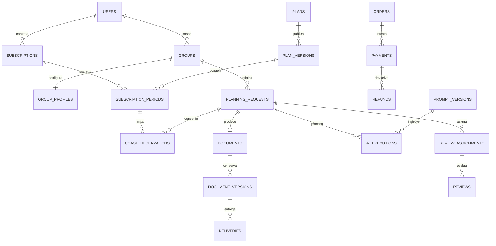

# Modelo de datos

Diseño lógico PostgreSQL, sin migraciones todavía. Tablas snake_case, PK bigint, FK explícitas, timestamptz (instantes UTC); fechas pedagógicas DATE. Dinero comercial en unidades menores enteras y moneda ISO; costos IA DECIMAL(18,8) con moneda y tipo de cambio congelado. No sumar monedas diferentes. JSONB para listas, snapshots y estructuras validadas; relaciones principales normalizadas.

## Identidad y perfil

- users: name, email UNIQUE, email_verified_at, password, status, onboarding_completed_at. Registro nunca acepta rol del navegador.
- roles: code UNIQUE; role_user: PK(user_id, role_id). ADMINISTRADOR, DOCENTE_CLIENTE y DOCENTE_REVISOR; capacidades en Policies, sin is_admin.
- schools: owner_id FK users, name, school_type, state, municipality opcional, notes.
- groups: owner_id, school_id, curriculum_version_id, grade_id FK grades, name, school_year, archived_at. UNIQUE(id,owner_id) para referencias compuestas.
- group_profiles: group_id UNIQUE, revision, preferred_format_id nullable FK institutional_formats, student_count, general_level, characteristics, difficulties, educational_needs, session_minutes, available_materials, teaching_preferences, preferred_activities, restrictions, management_observations, required_structure, preferred_assessment_tools, additional_notes. No nombres de alumnos. Actualizaciones incrementan revision; solicitudes anteriores conservan snapshot.

## Comercial

- plans: code UNIQUE, name, active.
- plan_versions: plan_id, number, price_minor, currency, interval_unit/count, max_planning_days, planning_limit, human_review_limit, correction_limit, group_limit, correction_window_days, sla_hours, features JSON, published_at. UNIQUE(plan_id,number); publicada inmutable. max_planning_days y planning_limit son enteros >0; human_review_limit y correction_limit >=0, todos NOT NULL en MVP. correction_limit es rondas por solicitud; planning_limit y human_review_limit son unidades por periodo, según WORKFLOWS.md. human_review_required es característica explícita, no deducida del nombre.
- subscriptions: customer_id, plan_id, status (pending/active/past_due/cancelled/expired), starts_at, renews_at, cancel_requested_at, ends_at. Una suscripción vigente por cliente: bloqueo de users e índice único parcial customer_id WHERE status IN (active,past_due). Cancelación programada conserva status active hasta ends_at; no abre otra suscripción concurrente.
- subscription_periods: subscription_id, plan_version_id, starts_at, ends_at, status, entitlement_snapshot JSON, paid_order_id nullable. UNIQUE(subscription_id,starts_at). Periodos [inicio,fin), sin solapamiento bajo bloqueo; derechos no cambian al editar catálogo.
- orders: customer_id, subscription_period_id nullable, concept, total_minor, currency, status, idempotency_key UNIQUE, paid_at. Compra o renovación; múltiples intentos de pago.
- payments: order_id, customer_id, provider, provider_reference nullable, method, amount_minor, currency, status (pending/succeeded/failed/cancelled), occurred_at, confirmed_by nullable. UNIQUE(provider,provider_reference). Sin datos de tarjeta. Referencia manual también única.
- payment_events: provider, event_id, payload_hash, status, received_at, processed_at, error_code. UNIQUE(provider,event_id), conservar solo payload mínimo necesario.
- refunds: payment_id, amount_minor, status, reason, provider_reference, idempotency_key UNIQUE, completed_at. Suma confirmada <= pago bajo bloqueo; devoluciones parciales admitidas.
- usage_reservations: period_id, request_id, correction_request_id nullable, resource (planning/human_review/client_correction), operation_key UNIQUE, quantity, status (reserved/consumed/released), reserved_at, consumed_at, released_at. Reintento reutiliza operación; reservado+consumido <= límite aplicable al recurso. planning/human_review: límite por periodo, quantity=planning_units. client_correction: límite correction_limit por solicitud, quantity=1 por ronda; no sumar contra una cuota periódica inexistente.

## Solicitudes y operación

### Integridad implementada en 3D-H

La migración `2026_09_16_000001_harden_planning_commercial_integrity.php` complementa la de 3D, sin implementar el pipeline. Los nombres reales de las columnas comerciales son `calculation_snapshot`, `correction_limit_snapshot` y `human_review_required_snapshot`; los segmentos usan `planning_request_id`, `sequence`, `calendar_days` y `units`.

- `BORRADOR`, `ESPERANDO_INFORMACION` y `ESPERANDO_PAGO` admiten ausencia de autorización. `CANCELADA` también puede proceder de una solicitud todavía no autorizada. Los demás estados de `PlanningRequestStatus`, desde `LISTA_PARA_PROCESAR` hasta los de generación, revisión, entrega y corrección, requieren autorización comercial. Una autorización existente conserva su integridad e historial aunque cambie el estado.
- Constraint triggers `DEFERRABLE INITIALLY DEFERRED` sobre solicitudes, segmentos y reservas comprueban al commit la fila final de la solicitud: campos completos, entrada confirmada propia, identidad comercial mediante las FK compuestas de 3D, snapshot coherente con columnas/PlanVersion/derechos congelados, D/U y partición exacta de segmentos, reserva planning por U y reserva human_review por U si corresponde. Las claves son las existentes `planning-request:{id}:planning|human-review`.
- Se permite actualizar primero el padre y crear después segmentos, reservas y evento en la misma transacción. No se admite el commit del padre incompleto. La validación consulta el estado final, no la copia intermedia `NEW` de cada evento diferido. La migración valida también las solicitudes preexistentes y falla sin reparar silenciosamente datos inválidos.
- Una reserva requerida puede estar `reserved` o `consumed`; cambiar por SQL una solicitud válida a `GENERACION_IA` no pierde su validez. 3D-H no ejecuta consumo ni implementa transiciones del pipeline. Una reserva requerida no puede liberarse dejando intacta la autorización: la política transaccional de cancelación/liberación de solicitudes sigue pendiente y deberá definirse antes de implementar ese flujo. La liberación ya existente de reservas sin autorización dependiente sigue permitida.
- `UsageReservation` prohíbe DELETE operativo y congela id, periodo, recurso, cantidad, operation_key, planning_request_id, correction_request_id y reserved_at. Se conservan el trigger de transiciones `reserved → consumed|released` y los CHECK de timestamps de 3B; los timestamps terminales tampoco se reescriben.
- `SubscriptionPeriod` congela desde su **creación** id, subscription_id, plan_id, plan_version_id y todo `entitlement_snapshot`, incluidos sus límites. `OpenSubscriptionPeriod` ya los fija al crear, incluso para un periodo pendiente. Se permiten cambios de estado, fechas sujetos a las restricciones existentes y la vinculación posterior `paid_order_id` usada por `ActivatePaidOrder`; no se recalculan derechos de periodos históricos.
- Los BEFORE triggers preservan historial comercial y segmentos. La inserción de segmentos después de actualizar el padre se permite hasta completar U y se comprueba íntegramente al commit. `down()` restaura los triggers de 3D y elimina los nuevos; las funciones usan `CREATE OR REPLACE` para tolerar `migrate:fresh` de PostgreSQL.

- planning_requests: owner_id, group_id, subscription_period_id nullable hasta enviar, period_label, starts_on, ends_on, project, topic, curriculum_version_id, grade_id, creation_mode, selection_revision, curriculum_confirmed_at, pedagogical_notes, suggested_initial_assessment, planning_days, planning_units, commercial_calculation_snapshot JSONB, book_pages, required_activities, special_events, requested_assessment, comments, format_version_id nullable, status, due_at, input_revision, input_snapshot JSON, entitlement_snapshot JSON, current_version_id nullable, lock_version. CHECK ends_on>=starts_on. FK compuesta(group_id,owner_id) → groups(id,owner_id). No prohibir proyectos simultáneos; advertir periodos solapados.
- request_input_versions: request_id, revision, snapshot JSON, manifest JSON, created_by, reason, created_at. UNIQUE(request_id,revision). Snapshot completo de perfil, solicitud y archivos; el de planning_requests apunta al vigente y cada ejecución conserva revisión exacta.
- request_state_events: request_id, from_status, to_status, actor_id nullable, actor_type, reason, correlation_id, created_at. Append-only.
- request_blocks: request_id, code, stage, details sanitizados, opened_at, resolved_at, resolved_by. Ejemplos missing_information/payment_required/ai_failed/no_reviewer/format_pending.
- correction_requests: request_id, delivered_version_id nullable para internas, source_version_id, requester_id nullable, type (client/internal), reason, description, section_keys JSON, status, assigned_to nullable, requested_at, resolved_at, resolution, resulting_version_id nullable. Una corrección abierta por solicitud bajo bloqueo. Internas no gastan cupo del cliente.
- activity_logs: actor_id nullable, actor_type, action, subject_type/id, request_id nullable, before_summary, after_summary, reason, correlation_id, created_at. Referencia genérica solo para auditoría, no reemplaza FK comerciales. Sin secretos ni textos sensibles completos.
- outbox_events: event_key UNIQUE, type, aggregate_id, payload mínimo, published_at, attempts, available_at. Se crea en la misma transacción de negocio.
- notification_deliveries: event_key, recipient_id, channel, status, sent_at, error_code. UNIQUE(event_key,recipient_id,channel). Tablas técnicas Laravel notifications, jobs, failed_jobs, sesiones y resets.

## Archivos, formatos y documentos

- files: owner_id, request_id nullable, category (institutional_format/book/material/previous_plan/evidence/result/other), disk, path UNIQUE, original_name, detected_mime, size_bytes, sha256, scan_status, uploaded_by, created_at. Cuarentena no descargable ni consumible.
- institutional_formats: owner_id nullable para estándar, name, kind (standard/institutional), status (pending_analysis/configuring/ready/unsupported/archived).
- format_versions: format_id, number, source_file_id nullable, mapping JSON, schema_version, renderer, validation_report JSON, approved_by nullable, published_at. UNIQUE(format_id,number); publicación inmutable, requiere muestra válida.
- documents: request_id UNIQUE, owner_id, title. Documento lógico de planeación.
- document_versions: document_id, number, parent_version_id nullable, input_revision, content JSON validado, content_hash, created_by nullable, ai_execution_id nullable, status (draft/validated/approved), created_at. UNIQUE(document_id,number). Numeración bajo bloqueo; contenido inmutable, corregir crea hija.
- document_version_files: version_id, file_id, output_format, renderer_version; PK(version_id,file_id). Archivo generado adicional conserva anterior; si modifica contenido crea otra versión.
- approvals: request_id, version_id, kind (ai/human), ai_execution_id nullable, review_id nullable, actor_id nullable, approved_at. UNIQUE(version_id,kind). AI requiere ejecución de auditoría exitosa; human requiere review aprobada de esa versión.
- deliveries: request_id, version_id, delivered_at, created_by nullable, idempotency_key UNIQUE. Varias entregas por solicitud para correcciones. delivery_files: PK(delivery_id,file_id), congela archivos exactos. Reenvío no crea versión ni consumo.

## IA, revisión y costos

### Materialización Fase 4A

`prompt_templates` conserva identidad estable (`key`, `category`, `name`) y `active_version_id`; `prompt_versions` agrega `checksum` SHA-256 a los campos ya especificados. Una vez que un template tiene versiones, `key/category` quedan congelados. Una PromptVersion publicada es inmutable por Eloquent y trigger PostgreSQL; `active_version_id` solo puede apuntar a una versión publicada del mismo template.

`ai_executions` se materializa como frontera de trazabilidad sin ejecutar proveedor: request o futuro format_version, stage/mode, PromptVersion publicada, revisión de entrada, manifest, hash del prompt, operation_key único, estado y metadatos/costos nullable. Las FK a `format_versions`, `files` y `document_versions` se difieren hasta crear esas tablas; no se inventan registros ni costos para suplirlas.

### Materialización Fase 4B

- `request_blocks`: request_id, code, stage nullable, details JSONB sanitizado, opened_at, resolved_at, resolved_by y correlation_id. Índice único parcial evita dos bloqueos abiertos con el mismo request/code/stage. Identidad e historial son inmutables; resolver es la única mutación de dominio permitida.
- `outbox_events`: event_key UNIQUE, type, aggregate_id, payload JSONB inmutable, published_at, attempts, available_at, claimed_at, lease_expires_at y last_error_code. `published_at IS NULL` significa pendiente; lease vencida permite recuperación. Un evento publicado queda inmutable y no se borra.
- `ai_manual_packages`: un registro por `ai_execution_id`, disk/path privados, checksum SHA-256 y size_bytes. El registro es inmutable y referencia la ejecución por FK RESTRICT. `private_payload_file_id` de `ai_executions` continúa reservado para la futura tabla genérica `files`; 4B no inventa ese File todavía.
- Al iniciar generación, la transición y el consumo `usage_reservations(planning) reserved → consumed`, la ejecución y el outbox se confirman atómicamente. `human_review` permanece reserved. El paquete se escribe fuera de la transacción de BD y su hash se verifica antes de registrar la fila.
- `planning_generation_integrity_trg` es `DEFERRABLE INITIALLY DEFERRED`: al commit, cualquier solicitud comercialmente autorizada en `GENERACION_IA` o un estado posterior exige la reserva `planning` consumida, una `AiExecution` generation para la `input_revision` vigente, el `RequestStateEvent` de arranque y el `outbox_event` exacto. Así el orden padre/hijos dentro de la transacción es flexible, pero un `UPDATE planning_requests SET status='GENERACION_IA'` aislado no puede dejar un estado ficticio.
La identidad de una ejecución (sujeto, stage, mode, prompt, revisión, manifest y operation_key) es inmutable y el registro no se elimina; estado, proveedor/modelo efectivo, tiempos, hashes, errores sanitizados y costos podrán completarse por el pipeline posterior.

Los contratos JSON canónicos no son otra fuente curricular: `GeneratedPlanDraftV1` referencia códigos y `CanonicalPlanV1` copia textos desde `RequestInputVersion`. Ver `docs/ai/CANONICAL_PLAN_CONTRACT_V1.md`.

- prompt_templates: key UNIQUE, category (generation/audit/correction/document_analysis/format_adaptation), name, active_version_id nullable.
- prompt_versions: template_id, number, body, allowed_variables JSON, output_schema JSON, schema_version, published_at, created_by. UNIQUE(template_id,number); inmutable al publicar.
- ai_executions: request_id nullable para análisis de formato, format_version_id nullable, stage, mode, provider, model, prompt_version_id, input_revision, input_manifest JSON, rendered_prompt_hash, private_payload_file_id nullable, operation_key UNIQUE, status (pending/waiting_manual/running/succeeded/failed/uncertain), started_at, finished_at, duration_ms, error_code, sanitized_error, estimated_cost, actual_cost nullable, cost_currency, resulting_version_id nullable, audit_report JSON nullable. Exigir request_id o format_version_id. Payload privado para reproducibilidad con retención definida.
- ai_attempts: execution_id, number, provider_request_id nullable, status, duration_ms, input_tokens nullable, output_tokens nullable, estimated_cost, actual_cost nullable, error_code. UNIQUE(execution_id,number). Sumar intentos cobrados incluso fallidos.
- reviewer_profiles: user_id UNIQUE, grados mediante reviewer_grades(reviewer_id,grade_id,curriculum_version_id), PK(reviewer_id,grade_id), status, max_load, daily_max, rate_minor, currency; rate_minor es tarifa por unidad comercial. reviewer_availability: reviewer_id, starts_at, ends_at.
- review_assignments: request_id, reviewer_id, cycle, status (assigned/in_progress/completed/reassigned/cancelled), due_at, assigned_at, ended_at, rate_snapshot_minor (tarifa por unidad), units_snapshot, total_fee_minor, currency. Una activa por solicitud, bajo bloqueo. Conserva historial al reasignar.
- checklist_templates: name, active_version_id nullable. checklist_versions: template_id, number, items JSON con key/label/required, published_at; UNIQUE(template_id,number).
- reviews: assignment_id, version_id, checklist_version_id, answers JSON, observations JSON por sección, decision (draft/approved/correction/rejected/escalated), started_at, decided_at, active_seconds. UNIQUE(assignment_id,version_id); nueva versión inicia checklist vacío.
- reviewer_work_items: review_id UNIQUE, assignment_id UNIQUE, reviewer_id, rate_minor (por unidad), quantity, total_minor, currency, status (pending/approved/paid), approved_at, paid_at, settlement_id nullable. Un trabajo pagable por ciclo aprobado, no por cada vuelta interna.
- reviewer_settlements: reviewer_id, currency, status, reference, approved_by, paid_at. Total deriva de trabajos; idempotencia al marcar pagado. Sin nómina ni transferencia automática.
- request_financial_allocations: request_id UNIQUE, period_id, amount_minor, currency, basis, units, unit_allocation_snapshot JSONB, allocated_at. Ingreso asignado congelado al consumo.
- request_cost_entries: request_id, source_type, source_id, kind (ai/reviewer/fee/refund_adjustment), amount DECIMAL(18,8), currency, fx_rate, occurred_at. UNIQUE(source_type,source_id,kind). No duplicar costos de ejecución y sus intentos.
- time_entries: request_id, user_id, activity, seconds, occurred_at. Tiempo humano activo, separado de espera.

## Relaciones principales

## Integridad y migraciones

Propietarios de escuela/grupo/solicitud/archivo deben coincidir mediante FK compuestas cuando sea práctico y validación transaccional siempre. Versión, aprobación, corrección y entrega deben corresponder a la misma solicitud. FK RESTRICT en historial; archivar en lugar de borrar. Los metadatos de aprobación pueden actualizarse, los bytes/contenido histórico no.

Índices: requests(status,due_at), requests(owner_id,created_at), blocks(resolved_at,code), assignments(reviewer_id,status,due_at), executions(status,started_at), payments(order_id,status), usage(period_id,resource,status). Bloquear periodo para consumo, revisor para carga y solicitud para versión/transición. Orden fijo de locks, reintentos acotados por deadlock.

Migraciones: identidad → catálogo curricular → perfiles → catálogo comercial/suscripciones/periodos → pedidos/pagos → archivos/formatos → solicitudes → prompts/IA → documentos → revisión/aprobaciones → entregas/correcciones/uso → costos/eventos. Agregar al final FK circulares nullable: periodo/pedido, ejecución/versión, solicitud/versión actual, plantilla/versión activa. Migraciones reales deben separar creación de tabla y FK cuando cambie el orden. Probar restricciones y concurrencia con PostgreSQL.

## Extensión curricular y comercial — especificación de migraciones

Las ocho tablas de catálogo, tres pivotes de selección y curriculum_suggestions se definen íntegramente en [CURRICULUM.md](CURRICULUM.md); forman parte de este esquema. Sustituyen texto/JSON curricular editable de planning_requests como fuente de verdad. request_input_versions conserva snapshot textual completo inmutable; planning_requests.input_snapshot es copia de la revisión vigente, no otro origen editable. La evaluación sugerida pasa a requested_assessment después de confirmación; ambas se conservan con su procedencia.

planning_requests necesita UNIQUE(id,curriculum_version_id) y FK compuestas a grade/version; pivotes usan esa clave y (element_id,curriculum_version_id). Grade del grupo y de la solicitud deben coincidir al enviar. Tablas curriculares usan FK RESTRICT e índices(curriculum_version_id,code), contenidos(curriculum_version_id,educational_phase_id,formative_field_id) y pdas(curriculum_version_id,grade_id,curricular_content_id). Publicación/inmutabilidad con triggers y locks raíz descritos en CURRICULUM.md. JSONB no preserva representación byte a byte: checksum se calcula con serialización canónica estable; textos completos permanecen sin resumir.

planning_request_segments: request_id, position, starts_on, ends_on, days; UNIQUE(request_id,position), CHECK ends_on>=starts_on y days>0. Segmentos consecutivos sin huecos/solapamiento, cada uno <= max_planning_days congelado; acción de envío valida suma de días y número=planning_units. Una solicitud sigue teniendo un pipeline, revisión y documento lógico con secciones por segmento; no crear subsolicitudes ni pagos independientes. Es metadato para limitar alcance y auditar unidades.

commercial_calculation_snapshot incluye versión de regla calendar_days_v1, day_basis=calendar, fechas inclusivas, max_planning_days, planning_days, planning_units, segmentos, PlanVersion/periodo y confirmación docente. CHECK cantidades positivas al enviar; borrador admite null. usage_reservations conserva cantidades congeladas; no recalcular con plan vigente durante reintento.

PostgreSQL: bigint identity/PK Laravel, NUMERIC para costos, CHECK cantidades >=0 en vez de unsigned; JSONB en todos los campos descritos como JSON. Índices únicos parciales para una asignación activa por solicitud (assigned/in_progress), una corrección abierta (requested/accepted/processing) y una suscripción vigente. Definir correction_requests.status con esos estados y resolved/rejected/withdrawn; internas y externas se serializan por solicitud. Locks siguen necesarios para sumas de consumo, capacidad y devolución. No usar CHECK cross-table: FK/índices y acciones/triggers según regla. No añadir GIN sin consulta demostrada.

Orden ampliado: curricula y curriculum_versions → phases/grades/fields/contents/pdas/axes → grupos/perfiles → planes/periodos/pagos → archivos/formatos → solicitudes/selecciones/segmentos/propuestas → pipeline existente. Agregar preferred_format_id y selectable_version_id al crear sus tablas destino, junto a otras FK circulares pendientes. No existe DB implementada que migrar desde MySQL: se cambia el diseño de migraciones iniciales. Lista consolidada en TASKS.md.

