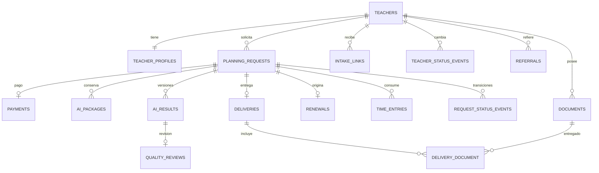

# Diseño de base de datos

Propuesta para MySQL. Tablas en inglés, interfaz en español. PK bigint, FK explícitas, timestamps en todas las tablas salvo pivotes. Fechas de negocio DATE; instantes UTC; dinero DECIMAL(10,2) no negativo, MXN. Estados VARCHAR con enums PHP, validación de dominio y restricciones CHECK donde corresponda. JSON solo para listas, checklist e instantáneas; relaciones principales normalizadas.

## Relaciones

## Entidades y campos

### users

Esquema Laravel: name, email UNIQUE, password, remember_token; is_admin boolean. Solo administrador habilitado entra en el panel. Sin registro público ni contraseñas sembradas en producción.

### teachers

name, phone (normalizado e indexado), email nullable indexado, state (entidad federativa), school, school_type (public/private), grade (1–6), group_name, student_count, group_characteristics TEXT, particular_needs TEXT nullable, usual_session_minutes, teaching_preferences TEXT nullable, notes TEXT nullable, monthly_price, joined_on, is_active default true.

Los contactos no son identificadores públicos ni claves de autorización. Coincidencias se revisan sin fusionar silenciosamente; pueden existir teléfonos compartidos. Índices: (is_active, joined_on), phone, email.

### teacher_profiles

teacher_id UNIQUE FK; requested_structure TEXT nullable, management_observations TEXT nullable, style TEXT nullable, recurring_adjustments TEXT nullable, preferred_assessment_tools TEXT nullable, available_materials TEXT nullable. Preferencias viven en teachers para evitar doble fuente. Formato institucional y planeaciones anteriores se relacionan mediante documents de alcance profile.

### teacher_status_events

teacher_id FK, is_active, occurred_at, reason nullable, user_id FK. Guardar evento de alta y de cada cambio activo/inactivo. Permite contar cancelaciones incluso tras reactivaciones. Índice (is_active, occurred_at).

### planning_requests

teacher_id FK, previous_request_id nullable FK a planning_requests UNIQUE (una continuación directa), starts_on, ends_on, grade, project_topic, contents TEXT, pda TEXT, formative_fields JSON (lista validada), articulating_axes JSON (lista validada), book_pages TEXT nullable, required_activities TEXT nullable, special_events TEXT nullable, requested_assessment_tools TEXT nullable, observations TEXT nullable, due_on, price, production_status default NUEVA, information_complete_at nullable, profile_snapshot JSON nullable.

El snapshot congela datos reutilizables al preparar la producción; la captura de una renovación toma el perfil vigente. Campos pedagógicos pueden estar incompletos al alta interna, pero se exigen al habilitar generación. CHECK ends_on >= starts_on. Índices (production_status, due_on), (teacher_id, starts_on). No prohibir periodos superpuestos: pueden ser proyectos distintos, mostrar advertencia. Estado del pago calculado desde payments, sin columna duplicada.

Estados: NUEVA, ESPERANDO_INFORMACION, ESPERANDO_PAGO, LISTA_PARA_GENERAR, GENERACION_IA, REVISION, CORRECCIONES, LISTA_PARA_ENTREGAR, ENTREGADA, RENOVACION_PENDIENTE, ARCHIVADA.

### request_status_events

planning_request_id FK, from_status nullable, to_status, user_id nullable FK (alta pública sin usuario), reason nullable, occurred_at. Solo anexar desde la acción de transición. Índice (planning_request_id, occurred_at). Base del conteo de correcciones.

### payments

planning_request_id UNIQUE FK, amount, paid_on nullable, reference nullable, method (transfer/cash/other), confirmed_at nullable, confirmed_by nullable FK users, notes nullable. Sin registro o sin confirmación = no pagado; con confirmación = pagado. Confirmar exige fecha, método y amount = precio vigente; precio y pago se corrigen juntos antes de producción. Sin abonos en este MVP. Índice (confirmed_at, paid_on). Repetir confirmación no duplica ingreso. Bloquear revocación ordinaria después de entrega; correcciones administrativas requieren razón e historial de estado cuando afecten el flujo.

### documents

teacher_id FK obligatorio; planning_request_id nullable FK; ai_result_id nullable FK; scope (profile/request/result); category (institutional_format/previous_plan/book_pages/support/generated/other); disk, path UNIQUE, original_name, mime_type, size_bytes, sha256, uploaded_by nullable FK users.

CHECK de alcance: profile sin request/result; request con request y sin result; result con request y result. La acción de adjuntar valida además que solicitud y versión pertenecen a la docente. Se usan FK concretas para evitar relaciones polimórficas sin integridad. Varios formatos o materiales permitidos. Índices (teacher_id, scope), planning_request_id, ai_result_id. Archivos entregados o citados por paquetes quedan preservados; para cambiar se agrega nuevo archivo.

### intake_links

teacher_id FK, renewal_id nullable FK, token_hash CHAR(64) UNIQUE, expires_at, revoked_at nullable, used_at nullable, resulting_request_id nullable UNIQUE FK. Token en claro solo se muestra al crearlo. Bloqueo de fila durante consumo; inválido/vencido/revocado/usado no permite crear. FK renewal_id se agrega después de crear renewals para resolver dependencia de migraciones.

### intake_submissions

submission_key_hash CHAR(64) UNIQUE, teacher_id FK, planning_request_id UNIQUE FK, submitted_at. Guarda únicamente identidad del envío público exitoso, no todo el formulario. Inserción en la misma transacción; reintento idéntico no crea filas nuevas. No devolver datos del perfil mediante esta clave.

### ai_packages

planning_request_id FK, version unsigned, input_snapshot JSON, document_manifest JSON, master_prompt_snapshot LONGTEXT, rendered_text LONGTEXT, generated_by FK users. UNIQUE (planning_request_id, version). Versionado bajo bloqueo de solicitud. Manifiesto: IDs, nombres, categorías y hashes de archivos, sin URLs públicas. La plantilla maestra vigente vive en message_templates con key ai_master; texto y variables quedan congelados aquí.

### ai_results

planning_request_id FK, ai_package_id nullable FK, version unsigned, model_used, generated_at, observations TEXT nullable. UNIQUE (planning_request_id, version). Archivos en documents. Validar que ai_package pertenece a la misma solicitud. Numeración bajo bloqueo. Versión entregada inmutable.

### quality_reviews

ai_result_id UNIQUE FK, checklist JSON, reviewed_by nullable FK users, approved_at nullable, observations TEXT nullable. Todas las claves obligatorias deben existir y ser true: grade_correct, dates_correct, contents_correct, pda_verified, pda_activity_coherence, appropriate_activities, opening_development_closure, congruent_assessment, realistic_materials, transversality, spelling, institutional_format, complete_documents.

Checklist creado vacío por versión; aprobar comprueba exactamente los 13 controles desde servidor. Revisar o añadir archivos invalida approved_at si aún no se entregó. No reutilizar revisión de otra versión.

### deliveries y delivery_document

deliveries: planning_request_id UNIQUE FK, ai_result_id FK, delivered_at, channel (whatsapp/email/other), observations TEXT nullable, recorded_by FK users. Debe corresponder a versión aprobada de esa solicitud. Una entrega inicial por solicitud; reenvíos del mismo material se anotan, sin módulo adicional.

delivery_document: delivery_id FK, document_id FK; PK compuesta. Al menos un archivo, todos de la versión aprobada; no se permite relacionar archivos de otra docente o solicitud. Se preservan bytes de archivos entregados.

### renewals

source_request_id UNIQUE FK, next_request_id nullable UNIQUE FK, next_starts_on, next_ends_on, contact_on, proposed_price, status (pending/converted/cancelled), converted_at nullable, cancelled_at nullable, cancellation_reason nullable. Docente derivada de la solicitud origen. CHECK de fechas. Índice (status, contact_on). Al convertir, next_request debe pertenecer a la misma docente y apuntar a source_request mediante previous_request_id. Transacción y UNIQUE evitan duplicados por doble clic o varios tokens.

### message_templates

key UNIQUE (information/payment_pending/ready/delivery/renewal/referral/ai_master), name, body LONGTEXT. updated_at permite detectar cambios; el paquete guarda su copia exacta. Seis plantillas de mensajes más una de instrucciones IA. Variables permitidas por tipo de plantilla en código; no Blade arbitrario ni eval.

### referrals

referrer_teacher_id FK, referred_name, referred_contact nullable, referred_teacher_id nullable FK, referred_on, converted_at nullable, discount_amount default 0, notes nullable. Conversión exige docente referida distinta de quien refiere. Se registra el descuento concedido; su aplicación al precio es manual y visible.

### time_entries

planning_request_id FK, user_id FK, worked_on, minutes unsigned > 0, activity (information/generation/review/correction/delivery/administration), notes nullable. Índices worked_on y (planning_request_id, worked_on). No duplicar acumulados; SUM para tiempo mensual y por solicitud.

## Integridad, borrado y migraciones

- Transacciones con bloqueo para confirmar pago, transiciones, numerar versiones, aprobar/entregar y convertir renovaciones. Revalidar estado actual al guardar.
- FK con RESTRICT para docentes, solicitudes, pagos, versiones y entregas: desactivar o archivar en lugar de borrar historial. Pivotes pueden usar CASCADE al eliminar su padre durante limpieza controlada, nunca bytes automáticamente.
- Borrado de documento solo si no está entregado ni referenciado por paquete; revisión invalidada si corresponde. El almacenamiento no es transaccional: compensar fallos y ofrecer limpieza de huérfanos verificada, sin borrar archivos por simple antigüedad.
- Orden: users; teachers/profiles/status; requests/status; payments; templates/packages/results; documents; reviews/deliveries/pivote; renewals; intake_links/submissions; referrals/time_entries. Añadir referencias circulares al final cuando corresponda.
- Tablas técnicas de sesiones/cache según configuración Laravel; no son entidades de negocio. Factories y seeders cubren todos los estados, pago pendiente, datos incompletos, varias versiones y renovaciones vencidas, solo con personas ficticias.
- Validaciones de pertenencia entre varias FK y reglas de flujo se prueban en servicios; no confiar exclusivamente en controles Filament. Probar restricciones reales con MySQL.
